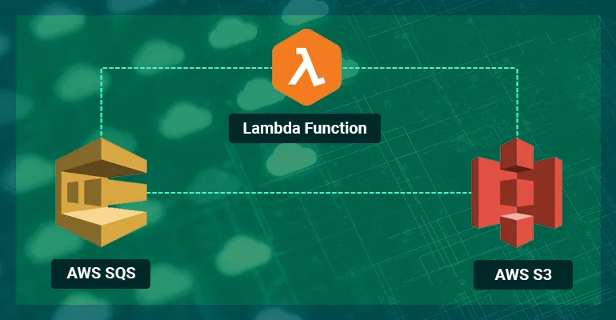

# Develop and Test AWS Applications Locally with Localstack

# List of localstack services

Previously, Localstack separates the aws services as follows:
* API Gateway at http://localhost:4567
* Kinesis at http://localhost:4568
* DynamoDB at http://localhost:4569
* DynamoDB Streams at http://localhost:4570
* Elasticsearch at http://localhost:4571
* S3 at http://localhost:4572
* Firehose at http://localhost:4573
* Lambda at http://localhost:4574
* SNS at http://localhost:4575
* SQS at http://localhost:4576
* Redshift at http://localhost:4577
* ES (Elasticsearch Service) at http://localhost:4578
* SES at http://localhost:4579
* Route53 at http://localhost:4580
* CloudFormation at http://localhost:4581
* CloudWatch at http://localhost:4582
* SSM at http://localhost:4583
* SecretsManager at http://localhost:4584


But for now, we can use one port 4465 (EDGE_PORT) to access the edge api for all aws services

# Running Localstack

One option for you to run the [Localstack as docker container using docker-compose.yaml](../localstack-docker-compose/README.md)

Here we have another approach to run Localstack, first pull this image:
```bash
$ docker pull localstack/localstack
```

Ensure Python 3.9 is installed:
```bash
$ pyenv versions
$ pyenv global 3.9.19
$ python --version
Python 3.9.19
```

Now we need to install `localstack` and `awscli-local` packages to use them with Docker container
```bash
$ pip install --upgrade localstack
Collecting localstack
  Downloading localstack-3.5.0.tar.gz (5.7 kB)
$ pip install awscli-local
Collecting awscli-local
  Downloading awscli-local-0.22.0.tar.gz (11 kB)
```

The final step is to run our Docker container, attaching the Docker socket. This is required for Lambda functions and other services that necessitate opening additional containers. 
```bash
$ docker run \
  --rm -it \
  -p 4566:4566 \
  -p 4510-4559:4510-4559 \
  -v /var/run/docker.sock:/var/run/docker.sock \
  localstack/localstack


LocalStack version: 3.5.1.dev
LocalStack build date: 2024-07-12
LocalStack build git hash: ab9613a82

Ready
```

Let’s use the basic command to list S3 buckets in order to verify that everything is working correctly. 
```bash
$ awslocal s3api list-buckets
{
    "Buckets": [],
    "Owner": {
        "DisplayName": "webfile",
        "ID": "75aa57f09aa0c8caeab4f8c24e99d10f8e7faeebf76c078efc7c6caea54ba06a"
    }
}
```


# Testing services

First, we need to [install `pipenv`](https://realpython.com/pipenv-guide/):
```bash
$ pip install pipenv
Collecting pipenv
  Downloading pipenv-2024.0.1-py3-none-any.whl (3.2 MB)
```

Verify:
```bash
$ pipenv --version
pipenv, version 2024.0.1
```

We will use the boto3 libraray in Python, which provides a great alternative to awscli commands
```bash
$ pipenv install boto3

Creating a virtualenv for this project...
Pipfile: /path/to/lambda-sqs-s3-stack/Pipfile
Using default python from /home/tvt/.pyenv/versions/3.9.19/bin/python3.9 (3.9.19) to create virtualenv...
⠙ Creating virtual environment...created virtual environment CPython3.9.19.final.0-64 in 677ms
  creator CPython3Posix(dest=/home/tvt/.local/share/virtualenvs/lambda-sqs-s3-stack-oOaLv0xA, clear=False, no_vcs_ignore=False, global=False)
  seeder FromAppData(download=False, pip=bundle, setuptools=bundle, wheel=bundle, via=copy, app_data_dir=/home/tvt/.local/share/virtualenv)
    added seed packages: pip==24.1, setuptools==70.1.0, wheel==0.43.0
  activators BashActivator,CShellActivator,FishActivator,NushellActivator,PowerShellActivator,PythonActivator

✔ Successfully created virtual environment!
Virtualenv location: /home/tvt/.local/share/virtualenvs/lambda-sqs-s3-stack-oOaLv0xA
Creating a Pipfile for this project...
Installing boto3...
Resolving boto3...
Added boto3 to Pipfile's [packages] ...
✔ Installation Succeeded
Pipfile.lock not found, creating...
Locking [packages] dependencies...
Building requirements...
Resolving dependencies...
✔ Success!
Locking [dev-packages] dependencies...
Updated Pipfile.lock (35b63359d999438d3e907ecb6ace25d1308a41b2a143969981cb78334ef592ec)!
To activate this project's virtualenv, run pipenv shell.
Alternatively, run a command inside the virtualenv with pipenv run.
Installing dependencies from Pipfile.lock (f592ec)...
```

Activate the virtual environment to isolate the development of this project
```
$ pipenv shell
. /home/tvt/.local/share/virtualenvs/lambda-sqs-s3-stack-oOaLv0xA/bin/activate
(lambda-sqs-s3-stack)
```

Create a python file for S3 service testing. You can use `boto3` with `Localstack` by specifying its endpoint URL.
```python
import boto3

endpoint_url = "http://localhost.localstack.cloud:4566"

s3 = boto3.client("s3", endpoint_url=endpoint_url)
print(s3.list_buckets())
```

Run the python file for testing. You can run it directly:
```bash
$ pipenv run python s3.py
```
or you can activate the vitual environment first then run the file
```bash
$ pipenv shell
(lambda-sqs-s3-stack) $ python s3.py

{'ResponseMetadata': {'RequestId': '51f5e0a0-7069-4cde-beea-b8a0354a7290', 'HostId': 's9lzHYrFp76ZVxRcpX9+5cjAnEH2ROuNkd2BHfIa6UkFVdtjf5mKR3/eTPFvsiP/XV/VLi31234=', 'HTTPStatusCode': 200, 'HTTPHeaders': {'server': 'TwistedWeb/24.3.0', 'date': 'Mon, 15 Jul 2024 02:17:51 GMT', 'content-type': 'application/xml', 'access-control-allow-origin': '*', 'access-control-allow-methods': 'HEAD,GET,PUT,POST,DELETE,OPTIONS,PATCH', 'access-control-allow-headers': 'authorization,cache-control,content-length,content-md5,content-type,etag,location,x-amz-acl,x-amz-content-sha256,x-amz-date,x-amz-request-id,x-amz-security-token,x-amz-tagging,x-amz-target,x-amz-user-agent,x-amz-version-id,x-amzn-requestid,x-localstack-target,amz-sdk-invocation-id,amz-sdk-request', 'access-control-expose-headers': 'etag,x-amz-version-id', 'vary': 'Origin', 'content-length': '270', 'x-amz-request-id': '51f5e0a0-7069-4cde-beea-b8a0354a7290', 'x-amz-id-2': 's9lzHYrFp76ZVxRcpX9+5cjAnEH2ROuNkd2BHfIa6UkFVdtjf5mKR3/eTPFvsiP/XV/VLi31234='}, 'RetryAttempts': 0}, 'Buckets': [], 'Owner': {'DisplayName': 'webfile', 'ID': '75aa57f09aa0c8caeab4f8c24e99d10f8e7faeebf76c078efc7c6caea54ba06a'}}
(lambda-sqs-s3-stack)
```

# Setup the VS Code Run and Debug with Python File
* [Python debugging in VS Code](https://code.visualstudio.com/docs/python/debugging)


# Simple Storage Service (S3)

Add this code to [s3.py](s3.py) to create new bucket:
```python
s3 = boto3.client("s3", endpoint_url=endpoint_url)

resp = s3.create_bucket(Bucket='test-bucket', CreateBucketConfiguration={
    'LocationConstraint': 'us-west-1'})

#'Location': 'http://test-bucket.s3.localhost.localstack.cloud:4566/'
```

It will create a bucket with response:
```json
{'ResponseMetadata': {'RequestId': '146d2903-1f3b-4bff-bfff-b39adbc81230', 'HostId': 's9lzHYrFp76ZVxRcpX9+5cjAnEH2ROuNkd2BHfIa6UkFVdtjf5mKR3/eTPFvsiP/XV/VLi31234=', 'HTTPStatusCode': 200, 'HTTPHeaders': {'server': 'TwistedWeb/24.3.0', 'date': 'Mon, 15 Jul 2024 02:35:18 GMT', 'access-control-allow-origin': '*', 'access-control-allow-methods': 'HEAD,GET,PUT,POST,DELETE,OPTIONS,PATCH', 'access-control-allow-headers': 'authorization,cache-control,content-length,content-md5,content-type,etag,location,x-amz-acl,x-amz-content-sha256,x-amz-date,x-amz-request-id,x-amz-security-token,x-amz-tagging,x-amz-target,x-amz-user-agent,x-amz-version-id,x-amzn-requestid,x-localstack-target,amz-sdk-invocation-id,amz-sdk-request', 'access-control-expose-headers': 'etag,x-amz-version-id', 'vary': 'Origin', 'location': 'http://test-bucket.s3.localhost.localstack.cloud:4566/', 'x-amz-request-id': '146d2903-1f3b-4bff-bfff-b39adbc81230', 'x-amz-id-2': 's9lzHYrFp76ZVxRcpX9+5cjAnEH2ROuNkd2BHfIa6UkFVdtjf5mKR3/eTPFvsiP/XV/VLi31234=', 'content-length': '0'}, 'RetryAttempts': 0}, 'Location': 'http://test-bucket.s3.localhost.localstack.cloud:4566/'}
```


Now we can add an object to the created bucket
```python
response = s3.put_object(
    Body='test.txt',
    Bucket='test-bucket',
    Key='test.txt',
)

print(response)
# 'HTTPStatusCode': 200

list_obj_resp = s3.list_objects_v2(
    Bucket='test-bucket'
)

print(list_obj_resp['Contents'])
# [{'Key': 'test.txt',
# 'LastModified': datetime.datetime(2024, 3, 9, 10, 6, 7, tzinfo=tzutc()),
# 'Size': 8, 'StorageClass': 'STANDARD'}]
```

You can see the response of creating object on S3:
```json
[{'Key': 'test.txt', 'LastModified': datetime.datetime(2024, 7, 15, 2, 49, 13, tzinfo=tzutc()), 'ETag': '"dd18bf3a8e0a2a3e53e2661c7fb53534"', 'Size': 8, 'StorageClass': 'STANDARD'}]
```

# Simple Queue Service (SQS)

We will focus on three main aspects of SQS:

* Creating a new queue
* Sending, receiving, and deleting messages from the queue
* Retrieving the URL of a newly created queue, which is required to send messages to it. Once you create a new queue, SQS will return a URL that can be used to send messages to the queue at a later time.

```python
sqs = boto3.client('sqs', endpoint_url=endpoint_url)

create_queue_resp = sqs.create_queue(
    QueueName='test-queue',
)
print(create_queue_resp)
# 'QueueUrl': 'http://sqs.ap-southeast-1.localhost.localstack.cloud:4566/000000000000/test-queue'

list_queues_resp = sqs.list_queues()
queue_url = create_queue_resp['QueueUrls'][0]
print(list_queues_resp)
# 'QueueUrls': ['http://sqs.ap-southeast-1.localhost.localstack.cloud:4566/000000000000/test-queue']
```

Now, we need to verify its functionality by sending a message to it and ensuring that it has been received successfully
```python
message = json.dumps({"test": 1})
send_message_resp = sqs.send_message(
    QueueUrl=queue_url,
    MessageBody=message
)
print(send_message_resp)
# 'HTTPStatusCode': 200

get_att_resp = sqs.get_queue_attributes(
    QueueUrl=queue_url,
    AttributeNames=[
        'ApproximateNumberOfMessages',
        'QueueArn'
    ]
)
print(get_att_resp)
# {'ApproximateNumberOfMessages': '1', 'QueueArn': 'arn:aws:sqs:ap-southeast-1:000000000000:test-queue'}
```

We should perform the receiving of this message and delete it from the queue
```python
#receive the message
received_message = sqs.receive_message(
    QueueUrl=queue_url,
    MaxNumberOfMessages=1
)

# delete received message
receipt_handle = received_message['Messages'][0]['ReceiptHandle']
delete_message_resp = sqs.delete_message(
    QueueUrl=queue_url,
    ReceiptHandle=receipt_handle,
)

print(received_message['Messages'][0]['Body'])
# '{"test": 1}'
```

Finally, let’s delete the queue, as we no longer need it.
```python
response = sqs.delete_queue(
    QueueUrl=queue_url
)
```


# AWS Lambda

Let’s start by creating a basic hello world function that will print the classic message for every programmer.
```python
def handler(event, context):
    print("Hello, World!")
    # You can add more logic here if needed
    return {
        'statusCode': 200,
        'body': 'Hello, World!'
    }
```

We need to zip the function since Lambda works with compressed files.
```bash
$ zip hello_world.zip hello_world.py
```

As the next step, we can create a Lambda function using the zip file and generate a URL for manual triggering.
```python
endpoint_url = "http://localhost.localstack.cloud:4566"

lambda_client = boto3.client('lambda', endpoint_url=endpoint_url)

zip_filename = "hello_world.zip"
with open(zip_filename, 'rb') as f:
    create_resp = lambda_client.create_function(
        FunctionName="hello-python-test",
        Runtime="python3.10",
        Role="arn:aws:iam::000000000000:role/lambda-role",
        Handler="hello_world.handler",
        Code={'ZipFile': f.read()},
        MemorySize=128,
    )
    
    print(create_resp)

create_url_resp = lambda_client.create_function_url_config(
    FunctionName="hello-python-test",
    AuthType="NONE",
)

function_url = create_url_resp["create_url_resp"]
print(function_url)
```

Now let’s call the function manually with the following bash command.
```bash
curl -X POST \
    'http://ouko2s9kmqdrrzc3lvkhewsnoptv4ju8.lambda-url.us-east-1.localhost.localstack.cloud:4566/' \
    -H 'Content-Type: application/json'
```

After the invocation, a new docker container is created specifically for this function to run in. This is done to create a container for our lambda runtime and is an easy and efficient way to get started.

Delete a function
```
$ awslocal lambda delete-function --function-name hello-python-test
```

List all function
```
$ awslocal lambda list-functions --region us-east-1
```

Get function with name
```
$ awslocal lambda list-functions --region us-east-1 --query 'Functions[?starts_with(FunctionName, `hello-python-test`) == `true`].FunctionName' --output text
```

# Application with all services



First of all, let’s define the infrastructure we need in a script for it. We need an S3 bucket and one SQS queue as a bare minimum.
```python
import boto3

# use this endpoint for localstack
endpoint_url = "http://localhost.localstack.cloud:4566"

s3 = boto3.client("s3", endpoint_url=endpoint_url)
sqs = boto3.client('sqs', endpoint_url=endpoint_url)
lambda_client = boto3.client('lambda', endpoint_url=endpoint_url)

# create bucket for an application
create_bucket_resp = s3.create_bucket(Bucket='app-bucket', CreateBucketConfiguration={
    'LocationConstraint': 'us-west-1'})

# create queue for application
create_queue_resp = sqs.create_queue(
    QueueName='app-queue',
)
```